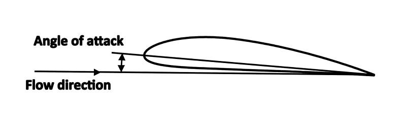

# Build an ML Pipeline for Airfoil noise prediction

## Scenario
I am a data engineer at an aeronautics consulting company. My company prides itself in being able to efficiently design airfoils for use in planes and sports cars. Data scientists in my office need to work with different algorithms and data in different formats. While they are good at Machine Learning, they count on me to be able to do ETL jobs and build ML pipelines. In this project I will use the modified version of the NASA Airfoil Self Noise dataset. I will clean this dataset, by dropping the duplicate rows, and removing the rows with null values. I will create an ML pipe line to create a model that will predict the SoundLevel based on all the other columns. I will evaluate the model and towards the end I will persist the model.

## Objectives

In this assignment I will:

- Perform ETL activity
  - Load a csv dataset
  - Remove duplicates if any
  - Drop rows with null values if any
  - Make transformations
  - Store the cleaned data in parquet format
- Create a  Machine Learning Pipeline
  - Create a machine learning pipeline for prediction
- Evaluate the Model
  - Evaluate the model using relevant metrics
- Persist the Model 
  - Save the model for future production use
  - Load and verify the stored model

 ## Datasets

In this lab I will be using dataset(s):

 - The original dataset can be found here NASA airfoil self noise dataset. https://archive.ics.uci.edu/dataset/291/airfoil+self+noise
 
 - This dataset is licensed under a Creative Commons Attribution 4.0 International (CC BY 4.0) license.

Diagram of an airfoil. - For informational purpose

  

Diagram showing the Angle of attack. - For informational purpose

  

